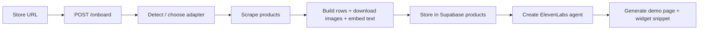
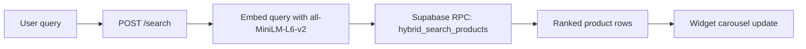
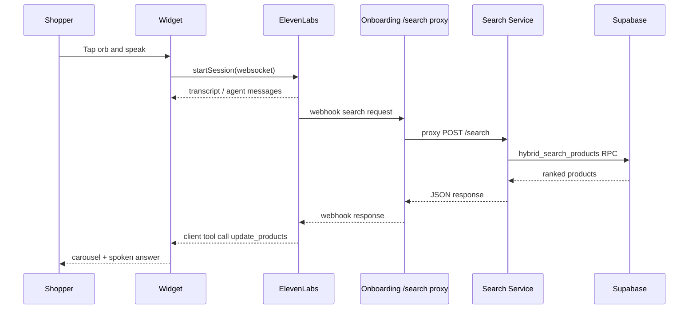

# Core Flows

## What This Is

This file explains the main end-to-end flows in the current product, from external request to code path to resulting artifact.

## Why It Exists

These flows cut across multiple services and are the quickest way to understand the real system.

## 1. Store Onboarding Flow

## What Is It

This flow turns a store URL into searchable products, an ElevenLabs agent, and a demo page.

## How It Works

## Where The Code Is

- `onboarding-service/routes/onboard.py`
- `onboarding-service/pipeline.py`
- `onboarding-service/adapters/`
- `onboarding-service/services/products.py`
- `onboarding-service/services/agent_creator.py`
- `onboarding-service/services/test_page.py`

## Tradeoffs

- All store types share one pipeline, but adapters still vary widely in reliability and source quality.
- Demo/test page generation is convenient for internal review, but it adds one more moving part to onboarding success.

## What Can Break

- Adapter mis-detection or site-specific scraping failures
- Product extraction returning zero products
- Supabase schema or credential issues
- ElevenLabs agent creation errors
- Widget script URL pointing at the wrong build output

## What Should Improve Next

- Integration tests across real sample stores
- More explicit retry or fallback behavior for partial failures
- Better visibility into which pipeline stage failed for admins

## 2. Search / Query Flow

## What Is It

This flow turns a shopper query into product matches for one store.

## How It Works

## Where The Code Is

- `search-service/main.py`
- `shared/embeddings.py`
- `shared/db.py`
- `shared/config.py`

## Important Contract

- `hybrid_search_products` is the core RPC contract.
- Query embeddings must use the same model as onboarding writes.

## Tradeoffs

- Search is simple and fast because most ranking logic lives in the DB RPC.
- This also means DB schema or RPC changes have outsized blast radius.

## What Can Break

- RPC signature drift
- embedding dimension mismatch
- invalid `store_id`
- aggressive thresholds returning empty results

## What Should Improve Next

- Better observability around empty-result cases
- More documented search tuning guidance
- Broader test coverage for query patterns and ranking quality

## 3. Widget / ElevenLabs Conversation Flow

## What Is It

This flow is the live voice interaction loop between the shopper, the widget, ElevenLabs, the search path, and the on-screen carousel.

## How It Works

## Where The Code Is

- `www.teampop/frontend/src/components/AvatarWidget.jsx`
- `www.teampop/frontend/src/App.jsx`
- `www.teampop/frontend/src/main.jsx`
- `onboarding-service/elevenlabs_agent.py`
- `onboarding-service/main.py`
- `search-service/main.py`

## Important Contract

- Tool names must match exactly across ElevenLabs config, prompts, and widget handlers.
- `store_id` must be constant in the webhook config, not LLM-generated.
- The widget must be served from built `/widget/widget.js`, not the Vite dev server, for external pages.

## Tradeoffs

- The voice loop is compelling when it works, but it is sensitive to latency and tool reliability.
- The single-tunnel setup simplifies demos but couples more external traffic through the onboarding service.

## What Can Break

- WebSocket disconnects
- filler speech or missed tool calls from the LLM
- ngrok restarts invalidating external URLs
- tool config drift between code and the created agent

## What Should Improve Next

- More automated verification of the full conversation cycle
- Better production deployment path than ngrok-based demos
- More resilient recovery when the search or WebSocket path fails mid-conversation

## 4. Client Request / Demo Delivery Flow

## What Is It

This is the intake-to-delivery workflow for merchants requesting a demo.

## How It Works

1. The website posts `name`, `email`, and `url` to `POST /api/submit-request`.
2. The onboarding service inserts a row into `agent_requests`.
3. Notifications fire asynchronously.
4. An admin logs in, starts `POST /api/process-request/{id}`, and the onboarding pipeline runs in a background thread.
5. When the pipeline finishes, the request moves to `ready`.
6. The admin sends the demo link with `POST /api/send-agent/{id}`.

## Where The Code Is

- `www.teampop/website/src/pages/RequestPage.jsx`
- `www.teampop/website/src/pages/AdminPage.jsx`
- `www.teampop/website/src/lib/api.js`
- `onboarding-service/routes/client.py`
- `onboarding-service/routes/admin.py`
- `onboarding-service/pipeline.py`

## Tradeoffs

- Very fast to operate internally
- Auth, rate limiting, and notifications are intentionally lightweight for alpha

## What Can Break

- admin auth mismatch
- database schema drift in `agent_requests`
- background task failures that only surface via logs or status fields

## What Should Improve Next

- Stronger auth
- request deduplication
- richer admin-side failure diagnostics

## Source Material

- `../agents/decisions.md`
- `../agents/completions.md`
- `../agents/roadmap.md`
