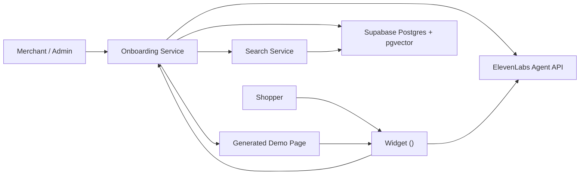
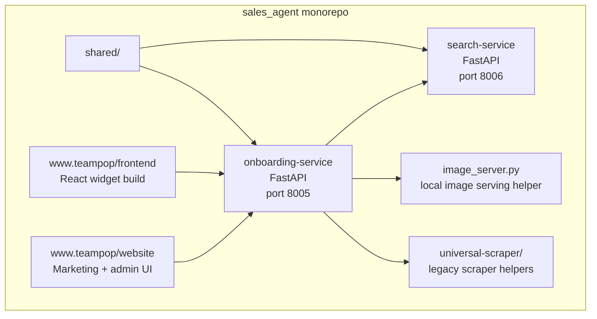

# System Overview

## What This Is

Team Pop is an early-alpha voice-first shopping assistant platform. A store is onboarded, its products are scraped and embedded, and a voice widget lets shoppers ask for products conversationally on a storefront or demo page.

This repo is a practical monorepo, not a pure microservices system. It contains multiple deployable services plus shared code, frontend apps, and some still-alpha operational glue.

## Why It Exists

- Give merchants a fast way to demo or embed a voice shopping assistant.
- Support more than one catalog shape: Shopify storefronts, Threadless artist shops, Supermicro enterprise catalogs, and a universal scraping fallback.
- Reuse one product storage and search layer across multiple storefront types.

## Core Users

- Internal team members onboarding stores and sending demos
- Merchants evaluating the widget
- Shoppers interacting with the voice agent
- Engineers maintaining scraping, search, and widget behavior

## High-Level Architecture

## Service / Container View

## How It Works

At a high level:

1. A store URL enters the onboarding pipeline.
2. The onboarding service chooses an adapter and scrapes product data.
3. Product rows are normalized, embedded with `all-MiniLM-L6-v2`, and stored in Supabase.
4. The onboarding service creates an ElevenLabs agent configured with webhook and client tools.
5. A demo page and widget snippet are generated.
6. The widget runs a voice conversation and uses the search path to retrieve products for the store.

Primary code paths:

- `onboarding-service/pipeline.py`
- `onboarding-service/routes/onboard.py`
- `onboarding-service/elevenlabs_agent.py`
- `search-service/main.py`
- `www.teampop/frontend/src/main.jsx`
- `www.teampop/frontend/src/components/AvatarWidget.jsx`

## Why A Monorepo

The current repo shape reflects shared constraints more than organization theory:

- onboarding and search must share the same embedding configuration
- the widget depends on onboarding-service serving the built IIFE for reliable demos
- frontend, backend, and documentation are evolving together quickly
- the `shared/` library reduces duplicated config, DB, and embedding logic

This rationale is directly supported by the 2026-04-07 monorepo refactor decision in `../agents/decisions.md`.

## Important Contracts

- `shared/config.py` defines the embedding model name used across services.
- `search-service/main.py` calls the `hybrid_search_products` RPC on every search.
- `www.teampop/frontend/src/main.jsx` registers `<team-pop-agent>`.
- `onboarding-service/routes/onboard.py` preserves `/onboard-threadless` and `/onboard-supermicro` as backward-compatible aliases.
- `onboarding-service/elevenlabs_agent.py` hardcodes `store_id` as a constant webhook parameter and depends on exact tool-name matching.

## Tradeoffs

- The architecture is fast to iterate on, but operational boundaries are still soft.
- Search and onboarding are separate services, but local/demo routing is intentionally collapsed through the onboarding service for ngrok convenience.
- Some production concerns are knowingly deferred: stricter CORS, stronger auth, rate limiting, broader test coverage, and deployment hardening.

## What Can Break

- Embedding model drift between onboarding and search silently degrades search results.
- Changes to `hybrid_search_products` without a matching service update break search.
- Serving the widget from Vite dev mode instead of the built IIFE breaks external demo pages.
- ElevenLabs tool-name mismatches break the conversation cycle.

## What Should Improve Next

- Production-ready auth, CORS, and rate limiting
- Better integration testing across adapters and the full voice loop
- More explicit deployment and environment documentation for non-demo usage

Related source docs:

- `../agents/constraints.md`
- `../agents/decisions.md`
- `../agents/completions.md`
